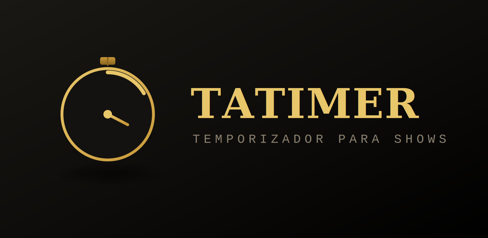

<div align="center">



# Tatimer — Temporizador para shows en vivo

**Temporizador para el monitor del ponente en eventos, conferencias y shows en vivo.**

Timer standalone con gestión de sesiones (ponentes, tiempos y títulos de ponencia) y vistas independientes para escenario y sala. Sin dependencias, sin servidor: funciona online o abriendo `index.html` en cualquier navegador.

[](https://javitatay.github.io/Tatimer/)
[](https://buymeacoffee.com/javitatay)

   [](LICENSE)

</div>

---

## ¿Qué es Tatimer?

Tatimer es un temporizador pensado para el monitor del ponente en eventos, conferencias y shows en vivo. Permite organizar un congreso entero con sus ponentes y tiempos, mostrar una cuenta atrás a pantalla completa en el escenario y proyectar en la sala quién interviene a continuación, todo controlado por un operador desde una única interfaz.

Está disponible online sin instalación y también funciona descargando `index.html` y abriéndolo localmente en cualquier navegador: **sin dependencias y sin servidor**.

### Funciones principales

- ⏱️ **Cuatro modos** — cuenta atrás, cuenta atrás hasta una hora fija, cuenta adelante y reloj en tiempo real.
- 👥 **Gestión de sesiones** — panel lateral con ponentes, títulos y tiempos individuales.
- 🖥️ **Vista Escenario** — timer a pantalla completa sincronizado para el monitor del ponente.
- 📢 **Vista Audience** — pantalla de sala con nombre y título del ponente activo, publicada manualmente por el operador.
- 🟡🔴 **Alertas visuales configurables** en directo (amarillo y rojo), activables o desactivables globalmente.
- 📊 **Barra de progreso segmentada** en tres zonas de color con marcador triangular de posición.
- ⏳ **Continúa en negativo** al terminar el tiempo, con aviso de tiempo consumido.
- 💬 **Mensajes al ponente** en pantalla en tiempo real, visibles también en la vista Escenario.
- 🕐 **Reloj de hora actual** en la vista Escenario, activable desde el operador.
- 🧹 **Modo limpio** — solo el contador y la barra de progreso a tamaño máximo.
- ⬛ **Blackout** — pantalla negra completa; el contador sigue corriendo por debajo.
- 🌙 **Tema oscuro / claro** y selector de idioma **ES / EN**.
- 🔗 **Control por URL** para integración con QLab u otras herramientas de show control.
- 📴 **Funciona offline e instalable como app (PWA)** — service worker propio, sin depender de la caché del navegador.
- 🔆 **Pantalla siempre encendida** durante el show (Wake Lock) — no se apaga ni activa el salvapantallas mientras el timer está en pantalla.
- ↩️ **Deshacer** al eliminar un ponente o una sesión — 5 segundos para recuperarlo antes de que se pierda.
- 🟢 **Indicador de ventanas conectadas** — el operador ve de un vistazo si las vistas Escenario y Audience siguen abiertas y recibiendo datos.
- ❓ **Panel de ayuda in-app** — referencia rápida de modos, sesiones y atajos, sin salir de la app (tecla `H`).

---

## 🌐 Uso

### Online

Abre [javitatay.github.io/Tatimer](https://javitatay.github.io/Tatimer/) en Safari o Chrome y arrastra la ventana al monitor del ponente. No necesita instalación ni conexión posterior.

### Local (offline)

1. Descarga todo el repositorio (`index.html`, `manifest.json`, `icon.svg`, `sw.js`).
2. Ábrelo en Safari o Chrome.
3. Arrastra la ventana al monitor del ponente.

Un service worker propio (`sw.js`) cachea la aplicación en la primera carga, así que funciona completamente offline desde la segunda vez que se abre, tanto en local como servida. También se puede instalar como aplicación (PWA) desde el navegador para tenerla como icono independiente. Las fuentes de Google Fonts se cargan con fuentes del sistema como alternativa si no hay conexión.

---

## ❓ Ayuda

Pulsa `H` o el botón `?` de la esquina superior derecha para abrir un panel de ayuda dentro de la propia app: repasa modos, sesiones, vistas, atajos de teclado y control remoto sin salir de Tatimer ni depender de tener este README a mano en mitad de un show. Se cierra con `Esc`, con el botón `✕`, o haciendo clic fuera del panel, y sigue el idioma (ES/EN) y el tema activos.

---

## 🖥️ Vistas adicionales

El operador puede abrir dos vistas independientes desde los botones de la esquina inferior derecha o con los atajos de teclado. Cada vista se abre en una ventana nueva que se puede arrastrar a otra pantalla y poner en pantalla completa (`F11`). La comunicación entre ventanas usa `localStorage` y funciona tanto en local (`file://`) como publicado en cualquier servidor.

Los botones **Escenario** y **Audience** de la interfaz del operador llevan un punto de estado: se pone verde en cuanto la ventana correspondiente está abierta y recibiendo datos, y vuelve a apagarse a los pocos segundos si se cierra o pierde la conexión. Es independiente de cómo se abrió la ventana (botón, atajo o URL directa) y sobrevive a recargar la página del operador.

### Vista Escenario (`E`)

Pensada para el **monitor del ponente** en el escenario. Muestra únicamente el timer a pantalla completa con fondo negro, la barra de progreso con los mismos umbrales de color configurados en el operador, el banner de tiempo consumido al pasar de cero, y los mensajes que el operador envía desde la interfaz principal. Se actualiza en tiempo real, tick a tick.

El operador puede activar un **reloj de hora actual** que aparece en la esquina inferior derecha de la vista Escenario, en gris muy tenue para no distraer al ponente. Se activa y desactiva desde el botón con icono de reloj situado junto al botón Escenario en la interfaz del operador.

Si la ventana pierde la señal más de 4 segundos, muestra un indicador de conexión perdida.

### Vista Audience (`A`)

Pensada para proyectar en la **sala de espera o hall** mientras se hace el cambio entre ponentes. Muestra el nombre del ponente en grande, el título de su ponencia, la duración asignada y el nombre de la sesión. El contenido no cambia automáticamente — el operador decide el momento exacto pulsando el botón **Publicar** en el panel de sesiones, lo que permite preparar el cambio sin que la sala lo vea antes de tiempo.

Al abrir la ventana carga el último ponente publicado, si lo hay.

### Flujo de trabajo con vistas

1. Pulsa `E` — se abre la vista Escenario; arrástrala al monitor del escenario y pon pantalla completa.
2. Pulsa `A` — se abre la vista Audience; arrástrala al proyector de sala y pon pantalla completa.
3. Trabaja desde la ventana principal del operador con normalidad.
4. Cuando llegue el turno de un ponente, cárgalo desde el panel de sesiones, pulsa **Publicar** para que aparezca en la sala, y arranca el timer.

---

## 📋 Panel de sesiones

El panel lateral de sesiones permite organizar un congreso o evento con varias ponencias antes del show. Se abre desde el botón `☰` del borde izquierdo o con la tecla `P`.

### Estructura

Cada **sesión** agrupa una lista de **ponentes**, cada uno con nombre del ponente, título de la ponencia y duración asignada (minutos : segundos).

Se pueden crear y gestionar múltiples sesiones — una por bloque del evento, por ejemplo. Las sesiones se guardan automáticamente en el navegador (`localStorage`) y persisten entre recargas. En cuanto hay dos o más, aparece un selector desplegable sobre el nombre para saltar entre ellas.

### Flujo de trabajo habitual

1. Abre el panel (`P` o el botón `☰` lateral).
2. Crea una sesión nueva y ponle nombre.
3. Añade los ponentes con sus tiempos desde el formulario inferior.
4. Reordena las tarjetas arrastrando si es necesario.
5. Durante el evento, haz clic en la tarjeta del ponente activo: el tiempo se carga automáticamente en el timer y hace reset.
6. Pulsa **Publicar** para enviar ese ponente a la vista Audience.
7. Pulsa `Space` para arrancar.

### Opciones del panel

| Elemento | Función |
|---|---|
| Selector de sesión | Cambia entre sesiones ya creadas (visible con 2 o más) |
| Campo de nombre | Nombre de la sesión activa. `Enter` o *Guardar* para confirmar |
| *Duplicar* | Copia la sesión activa entera (ponentes incluidos) como plantilla, p. ej. para el día 2 de un congreso |
| *Nueva* | Crea una sesión vacía |
| *Eliminar sesión* | Borra la sesión activa con confirmación (deshacer disponible 5 seg) |
| Tarjeta de ponente | Click para cargar su tiempo en el timer |
| `⠿` (asa de arrastre) | Reordena ponentes por drag & drop |
| `✕` | Elimina el ponente de la lista (deshacer disponible 5 seg) |
| Total | Duración acumulada de todos los ponentes de la sesión |
| **Publicar** | Envía el ponente actualmente cargado a la vista Audience |
| `↓ JSON` | Exporta solo la sesión activa como archivo `.json` |
| `↑ JSON` | Importa uno o varios archivos — detecta automáticamente el formato (ver abajo) |
| `⬇ Backup` | Exporta **todas** las sesiones de golpe, con fecha en el nombre del archivo |

> Solo se puede deshacer la última eliminación: si borras dos elementos seguidos, la posibilidad de recuperar el primero desaparece.

### Formato de exportación / importación

Sesión individual (lo que genera `↓ JSON`):

```json
{
  "id": "abc123",
  "name": "Mañana — Bloque A",
  "speakers": [
    { "id": "x1", "name": "Ana García", "title": "Inteligencia artificial aplicada", "min": 20, "sec": 0 },
    { "id": "x2", "name": "Marc Puig",  "title": "Diseño de experiencia sonora",    "min": 15, "sec": 0 }
  ]
}
```

Backup completo (lo que genera `⬇ Backup`), con varias sesiones dentro:

```json
{
  "type": "tatimer_backup",
  "version": 1,
  "exportedAt": "2026-07-02T10:00:00.000Z",
  "sessions": [ { "name": "Bloque A", "speakers": [...] }, { "name": "Bloque B", "speakers": [...] } ]
}
```

`↑ JSON` acepta cualquiera de los dos formatos anteriores, un array de sesiones sin envoltura de backup, o un array plano de ponentes sin envoltura de sesión (formato heredado). La importación siempre **añade** sesiones nuevas — nunca sobrescribe lo que ya tienes.

---

## 🎛️ Controles en pantalla

| Elemento | Ubicación | Función |
|---|---|---|
| `☰` / `✕` | Borde izquierdo | Abre / cierra el panel de sesiones |
| Minutos / Segundos | Panel izquierdo | Configura el tiempo inicial (modo cuenta atrás). Se actualiza en tiempo real al editar. |
| Hora objetivo | Panel izquierdo | Configura la hora de llegada (modo Hasta hora). Se actualiza en tiempo real al editar. |
| Cuenta atrás / Hasta hora / Cuenta adelante / Reloj | Panel derecho | Cambia el modo del temporizador |
| Alerta amarilla (min) | Panel derecho | Minutos restantes para activar el aviso amarillo |
| Alerta roja (min) | Panel derecho | Minutos restantes para activar el aviso rojo |
| Alertas ON / OFF | Panel derecho | Activa o desactiva todas las alertas globalmente |
| ES / EN | Panel derecho | Cambia el idioma de la interfaz |
| ◐ | Panel derecho | Alterna entre tema oscuro y tema claro |
| Iniciar / Reanudar | Centro inferior | Arranca o reanuda el contador |
| Pausar | Centro inferior | Pausa sin perder el tiempo |
| −30 seg | Centro inferior | Resta 30 segundos al tiempo |
| +1 min | Centro inferior | Añade 1 minuto al tiempo |
| Reset | Centro inferior | Vuelve al estado inicial |
| Blackout | Centro inferior | Cubre la pantalla con negro. El contador sigue corriendo. |
| 🕐 | Esquina inferior derecha | Activa / desactiva el reloj de hora en la vista Escenario |
| Escenario | Esquina inferior derecha | Abre / enfoca la vista Escenario |
| Audience | Esquina inferior derecha | Abre / enfoca la vista Audience |
| ⊞ | Esquina inferior derecha | Activa / desactiva el modo limpio |

---

## ⌨️ Atajos de teclado

| Tecla | Acción |
|---|---|
| `Space` | Iniciar / Pausar |
| `R` | Reset |
| `M` | +1 minuto |
| `S` | −30 segundos |
| `B` | Blackout |
| `C` | Modo limpio / vista completa |
| `P` | Abrir / cerrar panel de sesiones |
| `Esc` | Cerrar panel de sesiones (si está abierto) |
| `E` | Abrir / enfocar vista Escenario |
| `A` | Abrir / enfocar vista Audience |
| `H` | Abrir / cerrar el panel de ayuda |

---

## ⏲️ Modos

**Cuenta atrás** — introduce minutos y segundos antes de empezar. Al llegar a cero el contador continúa en negativo para no interrumpir, y aparece un aviso de tiempo consumido en la parte superior.

**Hasta hora** — introduce una hora fija (HH:MM) y el timer cuenta atrás hasta llegar a ella. Si la hora indicada ya pasó hoy, se asume automáticamente para mañana. Útil para "el show empieza a las 10:00" o "volvemos del descanso a las 17:30". Comparte el resto del comportamiento con cuenta atrás: alertas, barra de progreso, tiempo consumido en negativo.

**Cuenta adelante** — arranca desde cero y cuenta el tiempo transcurrido.

**Reloj** — muestra la hora actual en formato HH:MM:SS. No requiere iniciar ni pausar.

---

## 📊 Barra de progreso

La barra muestra tres zonas de color — verde, amarillo y rojo — cuyo tamaño proporcional se calcula a partir de los umbrales de alerta configurados. Un marcador triangular blanco indica la posición actual del tiempo. A medida que avanza el cronómetro, la zona ya consumida se oscurece y el marcador viaja hacia la izquierda.

Los umbrales se pueden ajustar en directo durante el show sin reiniciar el contador; la barra se recalcula al instante. Si las alertas están desactivadas, la barra se muestra completamente en verde. La vista Escenario refleja los mismos umbrales y colores.

---

## 🚦 Alertas de tiempo

Dos umbrales independientes configurables en el panel derecho:

- **Alerta amarilla** — minutos restantes para que el display y el marcador cambien a amarillo.
- **Alerta roja** — minutos restantes para que el display y el marcador cambien a rojo.

El toggle **Alertas ON / OFF** debajo de la alerta roja desactiva ambas alertas globalmente. Con alertas OFF el timer permanece en blanco independientemente del tiempo restante, la barra de progreso no muestra segmentos de color, y la vista Escenario no cambia de color. Útil para ponentes que prefieren no ver ningún aviso visual.

---

## 💬 Mensajes al ponente

El operador escribe en la caja de texto inferior y pulsa `Enter`. El texto aparece en pantalla grande en amarillo tanto en la ventana principal como en la vista Escenario, visible desde el escenario. `Esc` o el botón *Borrar* lo eliminan en ambas pantallas simultáneamente.

---

## ⬛ Blackout

El botón *Blackout* (o la tecla `B`) cubre toda la pantalla con negro. El contador sigue corriendo por debajo. Pulsar de nuevo el botón, la tecla `B` o hacer clic en cualquier parte de la pantalla negra desactiva el blackout y muestra el tiempo real transcurrido.

---

## 🧹 Modo limpio

El botón de maximizar (esquina inferior derecha) oculta todos los controles y muestra únicamente el contador y la barra de progreso a tamaño máximo. El panel de sesiones y los botones de vistas también se ocultan en este modo. Útil cuando el monitor del ponente está cerca del público. La tecla `C` hace lo mismo.

---

## 🔗 Control por URL

El temporizador acepta parámetros en la URL para integrarse con herramientas de show control como QLab:

```
https://javitatay.github.io/Tatimer/?action=start
https://javitatay.github.io/Tatimer/?action=pause
https://javitatay.github.io/Tatimer/?action=reset
https://javitatay.github.io/Tatimer/?action=addminute
https://javitatay.github.io/Tatimer/?action=subtractthirty
https://javitatay.github.io/Tatimer/?action=start&minutes=10&seconds=0
https://javitatay.github.io/Tatimer/?action=start&mode=countup
https://javitatay.github.io/Tatimer/?action=start&mode=clock
https://javitatay.github.io/Tatimer/?lang=en
```

Las vistas también se pueden abrir directamente por URL:

```
https://javitatay.github.io/Tatimer/?view=escenario
https://javitatay.github.io/Tatimer/?view=audience
```

---

## 🛠️ Para desarrolladores

Tatimer es una aplicación web autocontenida en `index.html`, sin dependencias externas ni framework. La persistencia y la comunicación entre ventanas se hacen con `localStorage`, por lo que funciona igual servido (GitHub Pages) o en local (`file://`).

Incluye un service worker (`sw.js`, estrategia stale-while-revalidate) y un `manifest.json` para funcionamiento offline real e instalación como PWA. Ambos son opcionales: si el navegador no los soporta o el archivo se abre desde un contexto no seguro (`file://`, `content://`), la aplicación funciona igual, simplemente sin esa capa de caché adicional.

Cuida accesibilidad de teclado (`:focus-visible`, `aria-pressed`/`aria-expanded` en los toggles, focus trap en el panel de sesiones) y contraste WCAG AA en ambos temas.

```
Tatimer/
│
├── README.md
├── LICENSE
├── manifest.json
├── icon.svg
├── sw.js
└── index.html
```

---

## 📄 Licencia

Tatimer se distribuye bajo la licencia **[GNU General Public License v3.0](LICENSE)**.

Eres libre de usar, estudiar, modificar y compartir este software. La única condición importante es que, si distribuyes una versión modificada, debe mantenerse también como código abierto bajo esta misma licencia, para que las mejoras sigan estando disponibles para todos.

[](LICENSE)

---

## ✉️ Contacto

**Javier Tatay Rubio**
📧 j.tatayrubio@edu.gva.es

---

<div align="center">
<sub>Probado en macOS Sonoma 14 · Safari · Google Chrome 124+ · Tatimer · 2026</sub>
</div>
